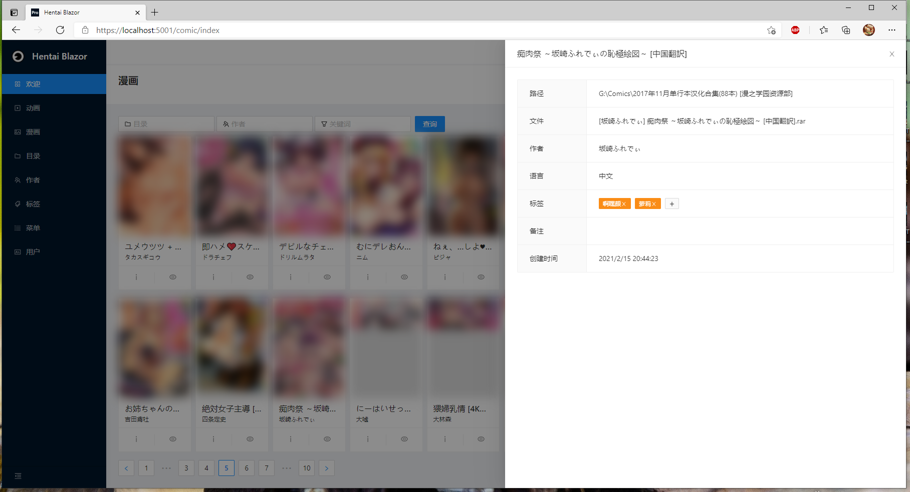

# Hentai Blazor

## 介绍

老司机驾驶舱——给各位二次元老司机提供的动漫管理平台。

  

编写本应用的目的主要是实践巨硬（Microsoft）的新一代前端框架Blazor与EntityFramework，本应用也给想要学习这套框架的童鞋提供了标准的CRUD案例。

## 开发状态

1.  2021-03-16 还处于框架学习中，仅编写了一些测试功能.
2.  2021-03-18 漫画板块完成了主要技术验证，基本可以跑了.
3.  2021-03-22 进一步熟悉了对话框组件用法，整个CRUD代码结构更为合理.
4.  2021-03-25 发现一个在编辑页面拿副本的坑，已用Clone的方法初步填了.
5.  2021-03-27 使用OnAfterRenderAsync生命周期优化页面加载方式，将读取压缩包的库替换成了更通用的SharpCompress支持rar、7z、zip等多种格式.
6.  2021-03-30 修复了漫画阅读分页读取的问题——漫画相关内容已完成最小功能集开发.

## 软件架构

本应用使用了.NET的新一代前后端框架，主要包含以下技术要点：

1.  dotnet - 巨硬的应用开发框架
2.  Blazor Server - 巨硬的新一代前端开发框架，是继WebForm、JSF、GWT后的又一次前后端一体化框架技术路线尝试
3.  EntityFramework - 巨硬的ORM持久层框架
4.  SQLite - 简单的单机数据库，考虑到本应用比较简单，就没有使用PostgreSQL这类的大部头了
5.  Ant Design Blazor Pro - 纳尼？居然有人把这套UI封成了razor组件库！

编写本应用的主要目的是通过.NET技术实践了三层开发的基本思想：

1.  通过ORM框架实现数据访问层，并将数据库操作服务封装为DAO层；
2.  通过razor页面的背板代码实现业务层，它面向业务外观，将多个DAO层组织起来实现相关功能；
3.  通过razor页面的前端标记库实现表现层，它调用背板代码提供的对象实现数据绑定。

本应用还包含一些额外的技术内容：

1.  文件系统读写
2.  读取压缩包
3.  高质量缩略图生成
4.  针对漫画的一些图像增强优化算法（中远期）
5.  视频文件串流转码（中远期）
6.  基于浏览器的视频播放及字幕加载（中远期）

## 安装教程

1.  可使用Visual Studio 2019对本应用进行编译和运行
2.  启动程序后会自动创建数据库hentaidb.db
3.  使用SQLite管理工具将hentaidb.sql中的菜单导入数据库

## 使用说明

1.  在目录维护中添加各位司机的车库
2.  漫画列表自动扫描目录，生成封面预览

## 致谢

1.  楼主真是个好人
2.  Ant Design Blazor开发人员
