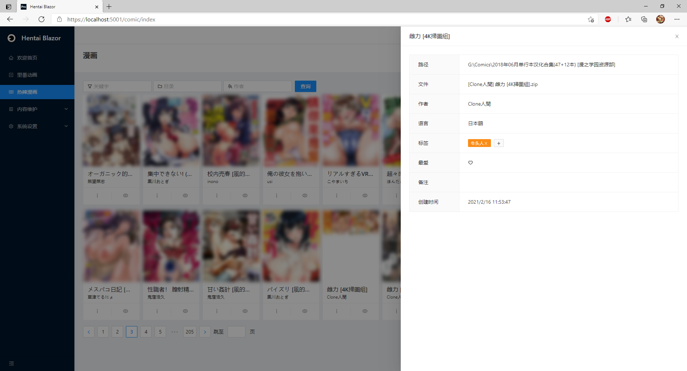
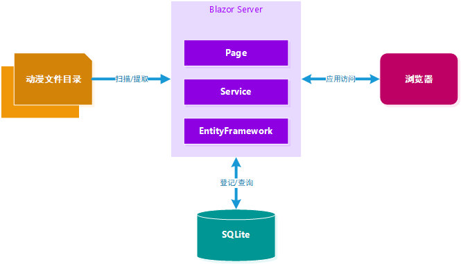

# HentaiBlazor

## Introduce

Old Driver's Cockpit——This is a Comic & Anime Management System for every gentleman and lady (also known as HENTAI).

  

The main purpose of this project is a replacement of "Comic Viewer", which is a desktop application written many years ago and no longer update.
Another reason is a practice of the next generation web technology Blazor Framework, which release by Macrohard (also called Microsoft).
For the people, who want to learn the blazor, the textbook like CRUD examples can be found in this project.

## Progress

1.  2021-03-16 Learning the Blazor Framework. Only a few tests.
2.  2021-03-18 The comic function is basicly complete.
3.  2021-03-22 Familiar with the modal component. Make an improvement of the CRUD structure.
4.  2021-03-25 Encounter a bug in edit mode. Solved by using clone method.
5.  2021-03-27 Improve the comic loading by OnAfterRenderAsync method. Replace the archive library to SharpCompress, which support rar, 7z, zip, etc.
6.  2021-03-30 Fix a pagination problem in comic reading function.
7.  2021-04-02 Add next page, previous page, fit width, fit height operation, improve the operation in comic reading function.
8.  2021-04-04 Make a prototype of the anime playback.
9.  2021-04-07 Add sortable to comic & anime.

## Architecture

This project use a .NET web framework, especially the following technologies：

  

1.  dotnet - The application framework developed by Microsoft
2.  Blazor Server - The next generation web generation web technology, also developed by Microsoft. It aims to all in one develop mode, maybe a successor of The WebForm, JSF, GWT technologies.
3.  EntityFramework - The ORM framework, son of .NET framework.
4.  SQLite - A simple database. This application is toooooo simple, so we don't use an enterprise RDBMS, such as PostgreSQL.
5.  Ant Design Blazor Pro - WTF? Some buddy make a razor version of Ant Design!

This project use .NET technologies to make an implements of a classic three-layer application:

  

1.  Use ORM framework to access the database. Compose the services to a DAO layer.
2.  Use the razor.cs code to make a Facade mode.
3.  Use the razor page to display the user interface.

Other technologies mentioned：

1.  File System Operations
2.  Read from a compressed archive file
3.  Create high quality thumbnail image
4.  The improved image scaling algorithm for comic (Medium and long term)
5.  The streaming for video playback（Medium and long term）
6.  The subtitle for video playback（Medium and long term）

## Installation

1.  You can use "Visual Studio 2019" to compile and run.
2.  The runtime may creates "hentaidb.db".
3.  Use a SQLite management tool to import "hentaidb.sql", which will init the menu. 

## Usage

1.  Add a directory to the Catalog.
2.  Perform scan to discover the files.

## Thanks

1.  The Very Nice Person of BBS
2.  Ant Design Blazor Developers
